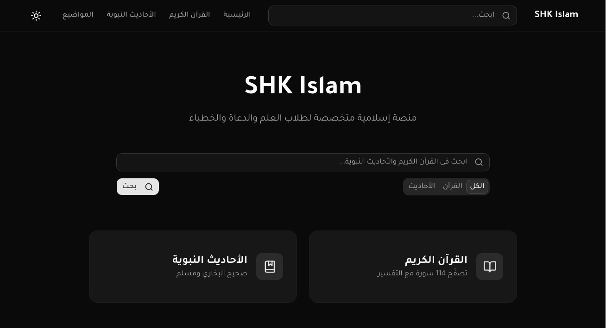
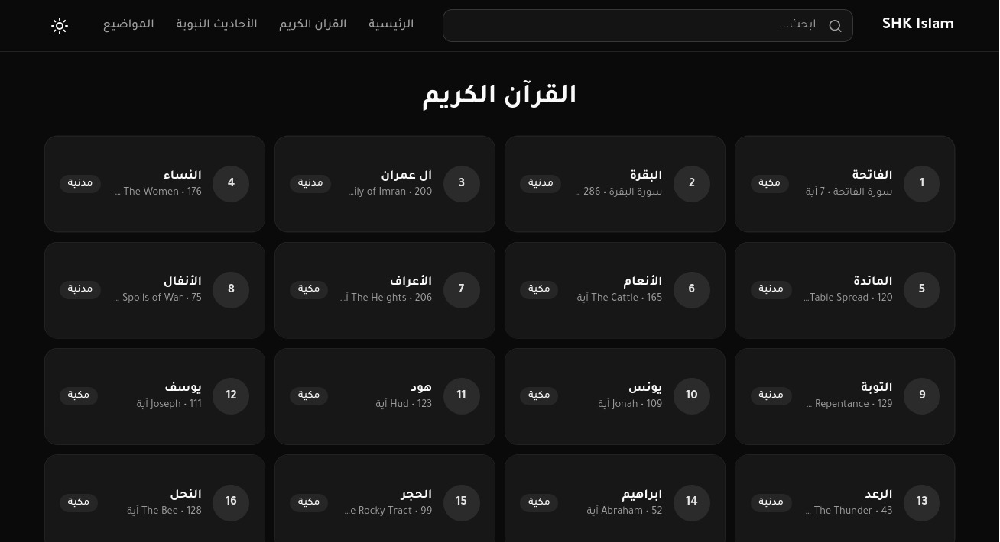
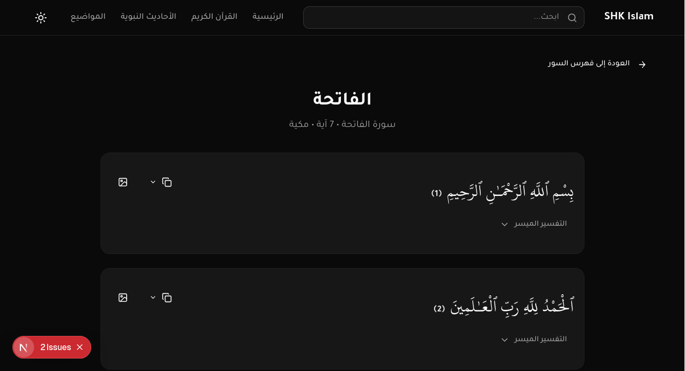
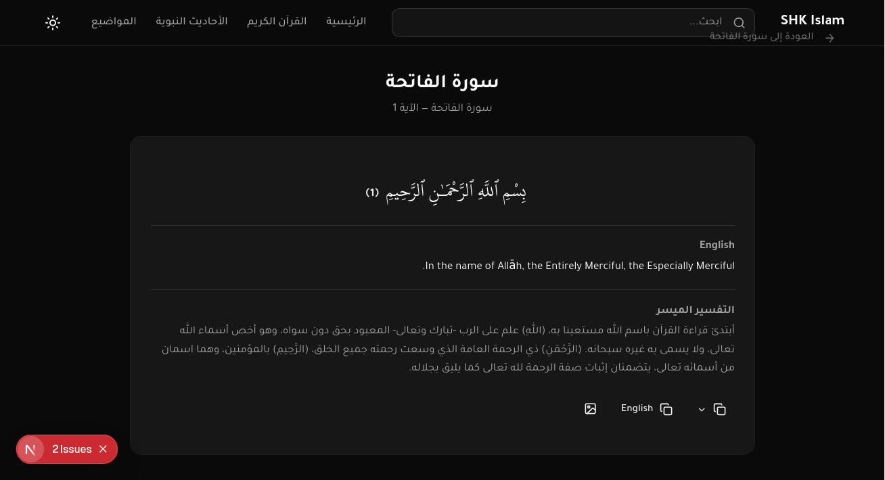
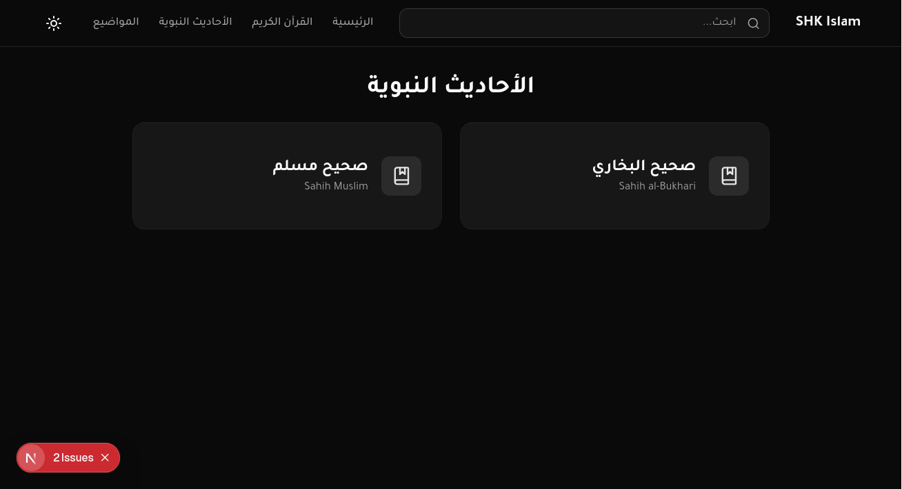
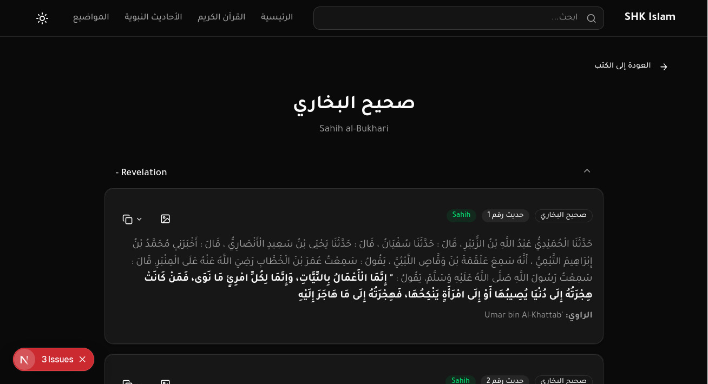
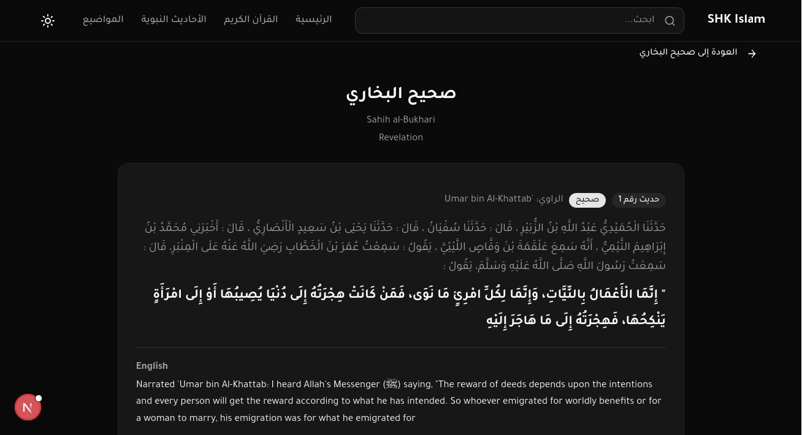
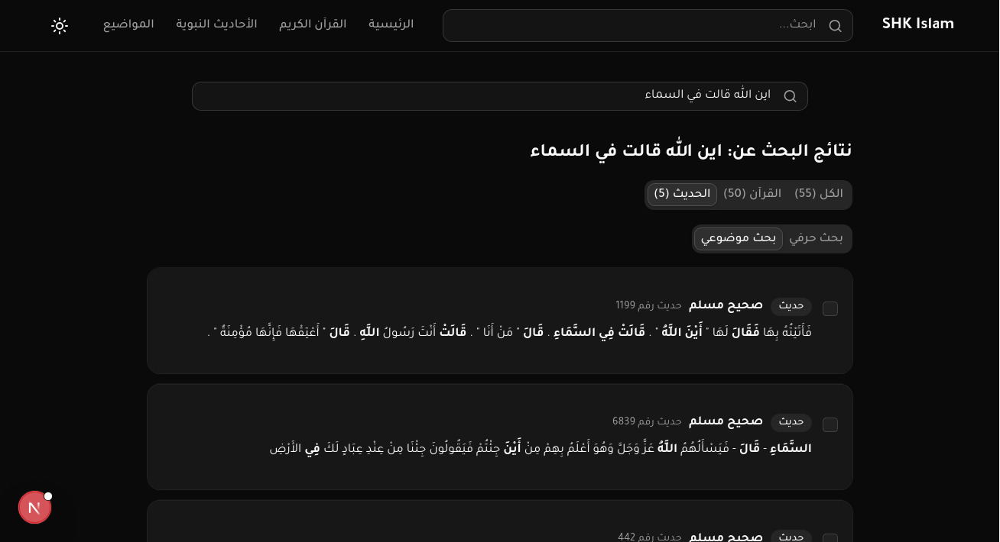

# SHK Islam

Islamic platform for students of knowledge, preachers, and speakers. Browse the Quran with tafsir, explore hadith collections, and organize research by themes.

## Features

- **Quran Browser** — 114 surahs with Uthmani text, translation, tafsir, and Asbab al-Nuzul
- **Hadith Collections** — Sahih Bukhari & Muslim with chapters, grades, and narrators
- **Themes** — Group related ayahs and hadiths under research topics
- **Global Search** — Search across Quran and hadiths simultaneously
- **Export to Image** — Generate shareable images of verses or hadiths
- **Dark Mode** — Light/dark theme toggle
- **RTL Arabic** — Full right-to-left support with Tajawal and Uthmanic fonts

<!-- SCREENSHOTS_START -->
<!-- Add screenshots here: -->
<!--  -->

<!--  -->



<!--  -->



<!--  -->

<!-- SCREENSHOTS_END -->

## Tech Stack

| Layer | Tool |
|-------|------|
| Framework | Next.js 16 (App Router) |
| UI | shadcn/ui + Tailwind CSS v4 |
| Database | PostgreSQL + Drizzle ORM |
| Runtime | Bun |

## Getting Started

```bash
# Install dependencies
bun install

# Set up database
cp .env.example .env  # configure DATABASE_URL
bun run db:push
bun run db:seed
bun run db:seed-themes

# Run dev server
bun run dev
```

Open [http://localhost:3000](http://localhost:3000).

Search and chat need the FastAPI service running alongside (see `../backend/`):
set `API_URL`/`NEXT_PUBLIC_API_URL` and the shared secrets in `.env` to match its
`.env`, or those routes return 500/502.

## Database Scripts

| Command | Description |
|---------|-------------|
| `bun run db:generate` | Generate migration files |
| `bun run db:push` | Push schema to database |
| `bun run db:seed` | Seed Quran & hadith data |
| `bun run db:seed-themes` | Seed theme data |

## Project Structure

```
src/app/                 # Next.js App Router pages
├── quran/[surahNumber]/ # Surah detail pages
├── hadith/[bookSlug]/   # Hadith book pages
├── themes/[slug]/       # Theme detail pages
├── search/              # Vector search UI
└── api/                 # API routes (search, chat, export-image, backend proxy)

src/
├── components/          # React components
├── db/                  # Drizzle schema & seeds
├── lib/                 # Utilities
└── assets/              # Screenshots used by this README

drizzle/                 # Database migrations
public/                  # Static assets
../backend/              # FastAPI service (separate repo): search, chat, keys
```

## License

Private project.
